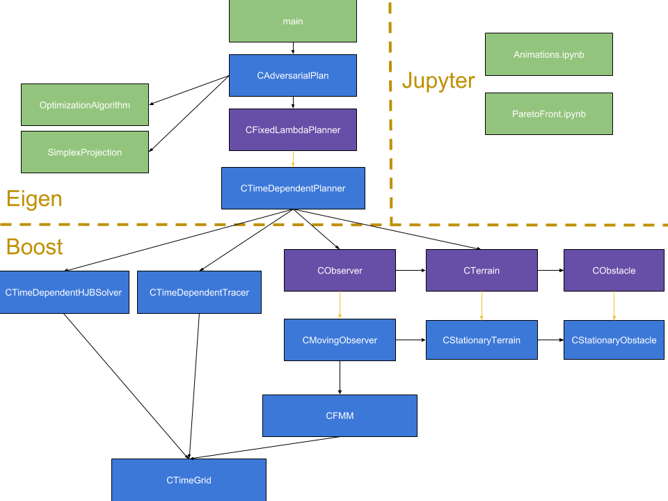

# License

This program is free software: you can redistribute it and/or modify it under the terms of the GNU General Public License as published by the Free Software Foundation, either version 3 of the License, or (at your option) any later version. This program is distributed in the hope that it will be useful, but WITHOUT ANY WARRANTY; without even the implied warranty of MERCHANTABILITY or FITNESS FOR A PARTICULAR PURPOSE.  See the GNU General Public License for more details.

You should have received a copy of the GNU General Public License along with this program. If not, see <http://www.gnu.org/licenses/>.

--------------------------------------------
# Manuscript

The primary purpose in distributing this source code is to enable readers to reproduce the numerical results reported in the manuscript "Time-Dependent Surveillance-Evasion Games" by Elliot Cartee, Lexaio Lai, Qianli Song, and Alexander Vladimirsky. A pre-print of this article can be found on Arxiv [here](https://arxiv.org/abs/1903.01332). 

--------------------------------------------
# Website

In addition to the manuscript, more information about the project can also be found at:
* [https://eikonal-equation.github.io/TimeDependent_SEG/index.html](https://eikonal-equation.github.io/TimeDependent_SEG/index.html).
Animations of the examples in the manuscript can be found here:
* [https://eikonal-equation.github.io/TimeDependent_SEG/examples.html](https://eikonal-equation.github.io/TimeDependent_SEG/examples.html).

--------------------------------------------
# Contributions / Acknowledgements

* Qianli Song and Lexiao Lai have been responsible for a large part of our time-dependent implementation and testing of the method, with help from Elliot Cartee during the REU program. 
* Elliot Cartee and Alexander Vladimirsky were responsible for writing and editing the manuscript.  
* Alexander Vladimirsky supervised the overall project, formulated this model of SE games, and contributed  several algorithmic ideas.  
* The authors are indebted to Marc Gilles, whose algorithms and implementation for the stationary case served as a foundation for this work.  
* The authors are also grateful to Casey Garner and Tristan Reynoso for their valuable help in implementation and testing during the summer REU-2018 program at Cornell University.

--------------------------------------------
# Instructions

## Requirements
The C++ Code requires two external libraries:
* [Boost](http://www.boost.org/), which is used for implementation of multidimensional arrays and heaps.
* [Eigen](http://eigen.tuxfamily.org/index.php?title=Main_Page), which is used for linear algebra.

Currently the C++ code is run through a Makefile that assumes the libraries are installed in the `/usr/local/include` directory.
If those libraries are installed elsewhere, you will have to modify the [Makefile](https://github.com/eikonal-equation/TimeDependent_SEG/blob/master/Makefile) to make sure both libraries are properly linked.

The code uses the C++14 standard, and can be compiled using both gcc and icpc.

The plotting scripts are in [jupyter notebooks](https://jupyter.org/).
The Python code in the notebooks requires [numpy](https://numpy.org/), [matplotlib](https://matplotlib.org/), and [ffmpeg](https://www.ffmpeg.org/).

## Running the code

Assuming the libraries are linked, you should be able to compile the code and run the test cases.

To compile, make sure you are in the folder /TimeDependent_SEG/ and use the command `make` from the command line.

The four examples in the manuscript/website can be reproduced using the following commands:
* To compile & run example 1 `NoObstacleTest()` (0 obstacles, 2 patrol trajectories, Omnidirectional sensor):
` make run TEST='1' `
* To compile & run example 2 `ObstacleTest()` (1 central obstacle, 2 patrol trajectories, Omnidirectional sensor):
` make run TEST='2' `
* To compile & run example 3 `FigureEightAnisoTest()` (3 rectangular obstacles, 2 patrol trajectories, Sector-restricted sensor):
` make run TEST='3' `
* To compile & run example 4 `MazeTest()` (Maze-like domain, 4 different starting locations along the same patrol trajectory, Sector-restricted sensor):
` make run TEST='4' `

## Visualizing output

### Animations

Once you have run the C++ code, you can visualize the output by running the Jupyter notebook in the python folder [here](https://github.com/eikonal-equation/TimeDependent_SEG/blob/master/plotting/Animations.ipynb).

To plot the different test cases, you will have to change the `example` variable in the first line of the Jupyter notebook accordingly.
* To plot results from example 1 (0 obstacles, 2 patrol trajectories, Omnidirectional sensor): set `example=1`
* To plot results from example 2 (1 central obstacle, 2 patrol trajectories, Omnidirectional sensor): set `example=2`
* To plot results from example 3 (3 rectangular obstacles, 2 patrol trajectories, Sector-restricted sensor): set `example=3`
* To plot results from example 4 (Maze-like domain, 4 different starting locations along the same patrol trajectory, Sector-restricted sensor): set `example=4`

### Pareto fronts

For examples 1 and 2, you can also visualize the Pareto front by running the Jupyter notebook [here](https://github.com/eikonal-equation/TimeDependent_SEG/blob/master/plotting/ParetoFront.ipynb)

# Coding conventions

### C++ Naming conventions
The C++ code is written according to the following naming conventions:

* Class names start with a upper case `C` with the rest of the name in Camel case
* Arguments of functions start with a lower case `a`
* Fields start with a lower case `f`
* All functions start with lower case
* Private functions and most inline functions are written in lower case (with underscores)
* All other functions are written in Camel case
* Local variables are in all lower case (with underscores)
* Global constants are in all upper case (with underscores)
* Filenames are in Camel case (except for `main.cpp`)

Otherwise, the code is mostly written to conform to the standards of the [Google C++ Style Guide](https://google.github.io/styleguide/cppguide.html)

### Code Architecture

* Purple boxes are abstract classes
* Blue boxes are regular classes
* Green boxes are not classes
* Yellow arrows denote an inheritance relationship
* Black arrows denote that one file depends on the other

### Boost vs Eigen

The lower level part of the code includes how the grids are handled, visibility computations, the time-dependent HJB solver, and the trajectory tracer. All of the low-level work relies on the class boost::multi_array, which is a memory efficient implementation of multidimensional arrays.

The higher level part of the code includes the projected subgradient method and diverse functions in CAdversarialPlan use the Eigen library to handle all of the linear algebra.